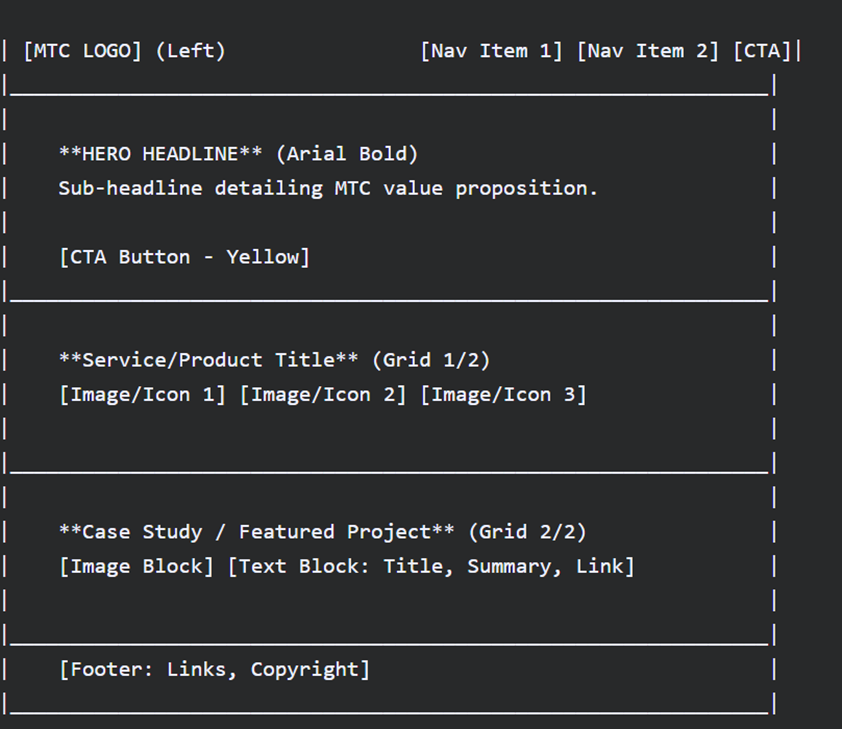

#Web development Part 1 Project Propsal 1

###Student Information
* **Name:**Makayla Cloete
* **Student ID:**ST10516528
* **Course:**Bachelor of information technology in business systems

##Project Overview
MTC Holdings is launching a 12-week website development project to transition its traditional retail model into an AI-driven, user-focused platform serving lower-to-middle income South Africans. The proposed site will feature GenAI search, machine learning for reordering, and integrated pharmacy/grocery services, supported by a 5-column layout designed for accessibility and efficiency.

##Website Goals and Objectives
* **Goals:**
•	We are building this for specific person, not just ‘traffic’. If we understand what they need, the design  will naturally follow.
•	The site should feel like a helpful conversation. Whether they need a service or just a phone number, it should be easy to find.
•	We are setting clear goals like 30% growth not just for the number, but to make sure we’re reaching the people we want to help.

##Key Features and Funcionality
* **Key Features:**
o	Homepage features:
We are making the site much more visual and modern, using big and beautiful images to help the user find what they need.
o	About us:
We cleaned up the layout so the user can find deals and products quickly, without any of the usual headache.
o	Contact us page:
If the user has any questions or need to track an order, our virtual assistants and help center are ready to get the answers right away.
o	Service:
	Grocery Pickup and Delivery:
Our customers can order groceries online and choose between home deliveries or counter pickup, making it easier to manage their time and schedule.
	Pharmacy Services: 
The site allows users to refill prescriptions, manage medications, and schedule immunizations online, providing a comprehensive healthcare solution.
* **Funcionality:**
This website has generative AI to understand queries focusing on the users keywords instead of the other unnecessary information that they provide to get straight to the point. The platform uses machine learning to predict customer needs, allowing them to save time through reordering and personalized products recommendations based on purchase history.

##Timeline and Milestons 
Phase 1: discovery and strategy 	;Week 1 ;	Audience personas and KPI baseline.
Phases 2: website design	;Week 2-3	; Grid layouts, branding and homepage UI.
Phases 3: Technical Development 	;Week 4-7 ;AI engine, retail modules and logistics.
Phases 4: Content and SEO	;Week 8	;Help center and product description audit.
Phase 5: QA and User Testing 	;Week 9-10	;Navigation, delivery tracking and mobile UX.
Phase 6:  Launch and Optimization	;Week 11-12	;Deployment and traffic growth tracking.

##Part 1 Details
* **Purpose:**
•	MTC holdings, focuses the most on lower-to-middle income customers for those who seek affordable products with good quality for example groceries and essential house hold products.
* **Target Audience:**
budget-conscious, middel-income families and individuals income from 40k-90k.
* **Design Choices:**
•	Color scheme:
o	The company has chosen a palette that feels familiar to the eye. The yellow adds a touch of warmth while our blues help keep everything clear and easy to follow.
•	Typography:
o	Using Arial because it is cleaner and easy to read. It strikes a balance between being functional and     looking great, giving our brand a modern yet approachable feel.
•	Layout and design: 
o	MTC, uses a simple grid to keep everything we create organized and consistent. By keeping the design clean  and using the clear colors, it makes it easier for the user to find their way around the website.

* **Current Progress:**

##Sitemap
1.Home:file:///C:/Users/USER/Dropbox/Makayla%20college%20modules/Web%20Development%20project%201%20Part%201/Part1/index.html

2.About Us:file:///C:/Users/USER/Dropbox/Makayla%20college%20modules/Web%20Development%20project%201%20Part%201/Part1/about.html

3.Services:	
Grocery Pickup and Delivery:
Our customers can order groceries online and choose between home deliveries or counter pickup, making it easier to manage their time and schedule.
Pharmacy Services: 
The site allows users to refill prescriptions, manage medications, and schedule immunizations online, providing a comprehensive healthcare solution.

4.Contact Us:
file:///C:/Users/USER/Dropbox/Makayla%20college%20modules/Web%20Development%20project%201%20Part%201/Part1/contact.html

##Reference
Anon., 2011. Our purpose, values and vision. [Online] 
Available at: https://www.shopriteholdings.co.za
[Accessed 3 april 2026].

Anon., 2024. Is new always better? The case of the Walmart website. [Online] 
Available at: https://www.eyesee-research.com
[Accessed 13 april 2026].

Anon., 2025. Home,Layout, Typography,Color. [Online] 
Available at: https://brandcenter.walmart.com
[Accessed 13 april 2026].

Anon., 2025. Shoprite Holdings Plc (SHOPRT.zm) 2025 Annual Report. [Online] 
Available at: https://africanfinancials.com
[Accessed 8 april 2026].

Anon., n.d. Essential Project: Goals For New Website Owners: Website Purpose and Goals. [Online] 
Available at: https://easywebsites.co.za
[Accessed 3 april 2026].

Expert Panel, F. C. M., 2022. 15 Ways Brick-And-Mortar Stores Can Leverage Tech To Boost The Shopping Experience. [Online] 
Inc., W., n.d. About Walmart. [Online] 
Available at: https://corporate.walmart.com/
[Accessed 11 april 2026].

Ramlan, H., 2024. Walmart: Features and Services Explained. [Online] 
Available at: https://www.atomixlogistics.com
[Accessed 11 april 2026].

Robles, P., 2018. Walmart’s website redesign: Five first impressions. [Online] 
Available at: https://econsultancy.com
[Accessed 11 april 2026].

